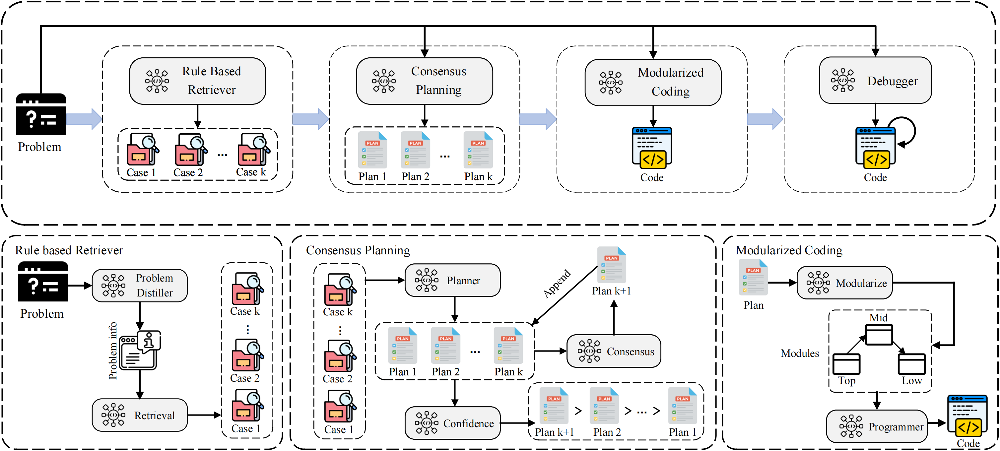

 

# SMAP: Self-enhanced Multi-Agent Code Generation for Competitive Problem Solving
      

## Abstract
While large language models (LLMs) have demonstrated impressive ability in natural language processing (NLP), they are struggling for addressing the code generation tasks with complicated human intent. It is universally recognized that‌ humans require insights into problem descriptions, elaborate planning to decompose complex solutions and organize code with modules prior to implementation. To achieve this aim, we introduce a self-enhanced multi-agent prompting (SMAP) approach to code generation tasks by imitating human developers, where enhanced LLM agents are mainly committed to emulating two heuristic phases, namely consensus planning phase and modular programming phase after distilling the problem. Specifically, in the consensus planning phase, LLM agent leverages the insight into the discrepancies among potential prospectives for high-quality plan with less overlooked details. Then, in the modular programming phase, the agent generates code solution by fully considering the hierarchical structure of code modules. We conduct extensive experiments on eight challenging competitive problem-solving and program synthesis benchmarks. Experimental results show that SMAP showcases remarkable code generation capabilities, achieving new state-of-the-art (pass@1) results. Moreover, our SMAP approach consistently delivers superior performance across various programming languages and varying problem difficulties.


## SMAP Overview

We propose a self-enhanced multi-agent promoting (SMAP) approach, which aims to make LLM agents think like senior programmers for competitive problem-solving. Our framework enhances the unsophisticated programming cycle with four LLM agents, and it includes rule-based retriever, consensus planning, structured programming and plan-derived debugging. SMAP first provides insights into problem description through rule-based retriever. Then it refines the plans derived from retrieved examples by reflecting on differences in perspectives. Sequentially, it enhances the relationship among modules with hierarchically modular coding. Finally, plan-derived debugging refers to the sample I/O from the problem description for fixing bugs in generated code, which requires no extra test case generation. In this section, we first introduce the retriever agent, and then illustrate the planning and the programming in detail. 
## Results of MapCoder on Eight Benchmarks
| LLM | Approach | HumanEval  | HumanEval-ET  | EvalPlus | MBPP  | MBPP-ET  | APPS  | xCodeEval  | CodeContest |
|-----------------|---------|--------------------|-----------------|-----------------|------------------------|-----------------|-----------------|-----------------|-----------------|
| ChatGPT | Direct   | 48.1% | 37.2% | 66.5% | 49.8% | 37.7% | 8.0%  | 17.9% | 5.5%   |
| | CoT | 68.9% | 55.5% | 65.2% | 54.5% | 39.6% | 7.3%  | 23.6% | 6.1%   |
| | Self-Planning | 60.3% | 46.2% | - | 55.7% | 41.9% | 9.3%  | 18.9% | 6.1%   |
| | Analogical | 63.4% | 50.6% | 59.1% | 70.5% | 46.1% | 6.7%  | 15.1% | 7.3%   |
| | MapCoder | 80.5% <br> ↑ 67.3% | 70.1% <br> ↑ 88.5% | 71.3% <br> ↑ 7.3% | 78.3% <br> ↑ 57.3% | 54.4% <br> ↑ 44.3% | 11.3% <br> ↑ 41.3% | 27.4% <br> ↑ 52.6% | 12.7% <br> ↑ 132.8%  |


## Running our project
1. Clone our project
```
git clone https://github.com/Md-Ashraful-Pramanik/MapCoder && cd MapCoder
```

2. Create a new conda or python virtual environment and run the following command
```
pip install -r requirements.txt
```

3. Set up the .env file by seeing the example.

4. Run the following command to see the options of running this projects
```
python src/main.py --help
```

5. Finally run this project. An example is given below:
```
python src/main.py --model ChatGPT --dataset HumanEval --strategy MapCoder
```

6. To run this projects with competitive datasets you need to setup the [ExecEval](https://github.com/ntunlp/ExecEval) for docker execution. Please visit this [link](https://github.com/ntunlp/ExecEval) to setup a docker container and run it using 5000 port. Change the line 50 of the file `src\evaluations\api_comm.py` for different setup. 

## Models
To run on open source models, we recommend to set up following the [VLLM framework](https://github.com/vllm-project/vllm) which can speed the generation significantly.
## Citation
```
@article{islam2024mapcoder,
  title={MapCoder: Multi-Agent Code Generation for Competitive Problem Solving},
  author={Islam, Md Ashraful and Ali, Mohammed Eunus and Parvez, Md Rizwan},
  journal={arXiv preprint arXiv:2405.11403},
  year={2024}
}
```
